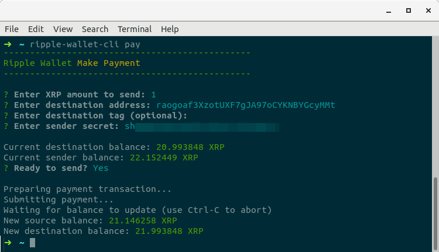

# Ripple Wallet

A lightweight command-line Ripple client built with node and the official [ripple-lib](https://github.com/ripple/ripple-lib) package.

Runs on Linux, Window and MacOSX

### Functionalities
- Generating a new wallet (works offline)
- Checking the balance of an existing wallet
- Making a payment from your existing wallet to another

### Installation
1. Make sure you have the current [Node LTS](https://nodejs.org/en/) release (or higher) installed on your system
2. Git clone this repository into a local directory
3. Run `npm install` the first time in that same directory

---

### Usage:

#### Generating a new wallet

Pull the internet cord of your computer (or disable wifi) and run the following command:

`npm run generate-wallet-offline`

#### Checking the balance of an existing wallet

To check the balance on your wallet, run:

`npm run balance`

You'll be asked for the public address to check

#### Making a payment from your existing wallet to another

To make a payment from a wallet you control to another address, run:

`npm run make-payment`

You'll be asked for the XRP amount to send, the destination address, the destination tag (optional), the sender address and finally the sender secret.

---

Donations are welcome at `rJysCK99GqUBmgB54mcV7NwxYH29NRs1QQ` :)